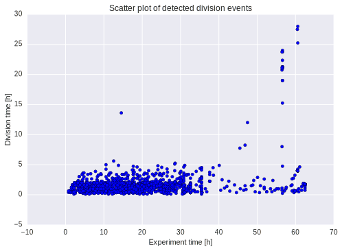
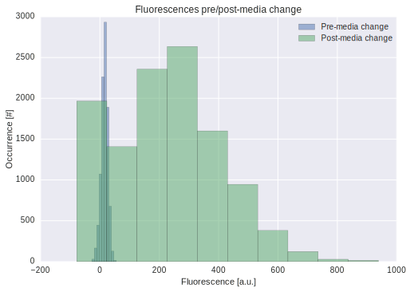
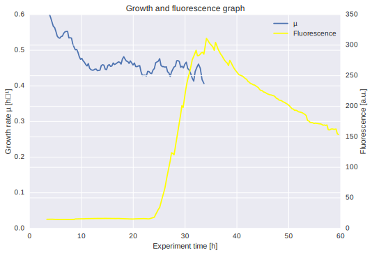
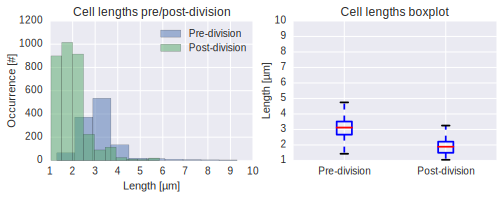
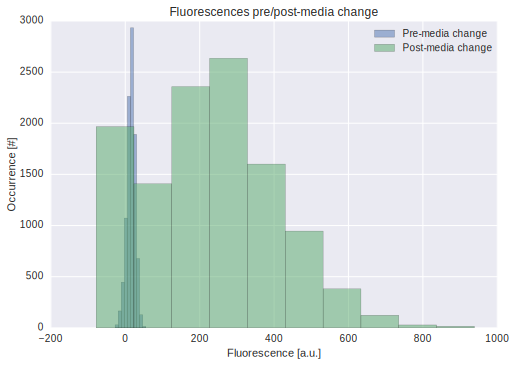

Example Analysis
================

This Jupyter/IPython notebook explains how to post-process the tabular
tab-separated value format produced by *molyso* to generate various
graphs.

If you are unfamiliar with IPython and the
NumPy/SciPy/matplotlib/pandas... Stack, we'd suggest you first read a
bit about it. We think it's definitely worth giving it a try, as it is a
greatly versatile tool for scientific programming endeavours.

This notebook expects a prepared data file in the current working
directory.

An example file is shipped with this notebook, it was created by calling
molyso:

.. code:: bash

    python3 -m molyso MM_Cglutamicum_D_aceE.ome.tiff -p -o MM_Cglutamicum_D_aceE_results.tsv

The file format is a tab separated table format, which can easily be
opened with Pandas.

See the following explanation of the table columns:

+-----------------------------------+--------------------------------------------------------------------------------------------------------------------------------+
| **Column name**                   | **Contents**                                                                                                                   |
+===================================+================================================================================================================================+
| about\_to\_divide                 | Whether this cell is about to divide, *i.e.*, this is the last occurrence of this cell                                         |
+-----------------------------------+--------------------------------------------------------------------------------------------------------------------------------+
| cell\_age                         | The cell age [h], relative to its "birth"                                                                                      |
+-----------------------------------+--------------------------------------------------------------------------------------------------------------------------------+
| cellxposition                     | The horizontal position [µm] of the cell (*i.e.*, of the channel)                                                              |
+-----------------------------------+--------------------------------------------------------------------------------------------------------------------------------+
| cellyposition                     | The vertical position [µm] of the cell within the channel                                                                      |
+-----------------------------------+--------------------------------------------------------------------------------------------------------------------------------+
| channel\_average\_cells           | The average count of cells detected in this channel                                                                            |
+-----------------------------------+--------------------------------------------------------------------------------------------------------------------------------+
| channel\_in\_multipoint           | The position number of the cell's channel within this multipoint position                                                      |
+-----------------------------------+--------------------------------------------------------------------------------------------------------------------------------+
| channel\_orientation              | A heuristic result whether high or low y positions represent the open end                                                      |
+-----------------------------------+--------------------------------------------------------------------------------------------------------------------------------+
| channel\_width                    | The width of the cell's channel                                                                                                |
+-----------------------------------+--------------------------------------------------------------------------------------------------------------------------------+
| division\_age                     | The age [h] at which the cell will divide                                                                                      |
+-----------------------------------+--------------------------------------------------------------------------------------------------------------------------------+
| elongation\_rate                  | The elongation rate [µm·s⁻¹] of the cell                                                                                       |
+-----------------------------------+--------------------------------------------------------------------------------------------------------------------------------+
| fluorescence\_\ *n*               | The mean fluorescence of the cell (with background subtracted)                                                                 |
+-----------------------------------+--------------------------------------------------------------------------------------------------------------------------------+
| fluorescence\_background\_\ *n*   | The background fluorescence of the cell's image                                                                                |
+-----------------------------------+--------------------------------------------------------------------------------------------------------------------------------+
| fluorescence\_count               | The count of fluorescences present in the dataset. The other fluorescence\_\*\_\ *n* fields occurr dependent on this number.   |
+-----------------------------------+--------------------------------------------------------------------------------------------------------------------------------+
| fluorescence\_raw\_\ *n*          | The mean raw fluorescence value of the cell                                                                                    |
+-----------------------------------+--------------------------------------------------------------------------------------------------------------------------------+
| fluorescence\_std\_\ *n*          | The standard deviation of the fluorescence of the cell                                                                         |
+-----------------------------------+--------------------------------------------------------------------------------------------------------------------------------+
| length                            | The cell length [µm]                                                                                                           |
+-----------------------------------+--------------------------------------------------------------------------------------------------------------------------------+
| multipoint                        | The multipoint number of the frame of the cell                                                                                 |
+-----------------------------------+--------------------------------------------------------------------------------------------------------------------------------+
| timepoint                         | The timepoint [s] of the cell sighting                                                                                         |
+-----------------------------------+--------------------------------------------------------------------------------------------------------------------------------+
| timepoint\_num                    | The timepoint number (within the dataset) of the cell sighting                                                                 |
+-----------------------------------+--------------------------------------------------------------------------------------------------------------------------------+
| uid\_cell                         | A unique id for this tracked cell                                                                                              |
+-----------------------------------+--------------------------------------------------------------------------------------------------------------------------------+
| uid\_parent                       | A unique id for the cell's parent cell                                                                                         |
+-----------------------------------+--------------------------------------------------------------------------------------------------------------------------------+
| uid\_thiscell                     | A unique id for this particular cell sighting                                                                                  |
+-----------------------------------+--------------------------------------------------------------------------------------------------------------------------------+
| uid\_track                        | A unique id for origin (the whole tracking from one start)                                                                     |
+-----------------------------------+--------------------------------------------------------------------------------------------------------------------------------+

.. code:: python

    file_name = 'MM_Cglutamicum_D_aceE_results.tsv'

.. code:: python

    # Some general setup routines
    %matplotlib inline
    %config InlineBackend.figure_formats=['svg']
    import pandas
    import numpy
    from matplotlib import pylab
    pandas.options.display.max_columns = None
    pylab.rcParams['figure.figsize'] = (10, 6)
    pylab.rcParams['svg.fonttype'] = 'none'
    pylab.rcParams['font.sans-serif'] = ['Arial']
    pylab.rcParams['font.family'] = 'sans-serif'
    try:
        import seaborn
    except ImportError:
        print("Optional dependency: seaborn to pretty up the graphs.")

.. code:: python

    # we first open the file via Pandas, it is formatted so that it can be read with the read_table command.
    
    results = pandas.read_table(file_name)
    
    # let's take a sneak peek into the file:
    results.head()

.. raw:: html

    

    <table border="1" class="dataframe">
      <thead>
        <tr style="text-align: right;">
          <th></th>
          <th>about_to_divide</th>
          <th>cell_age</th>
          <th>cellxposition</th>
          <th>cellyposition</th>
          <th>channel_average_cells</th>
          <th>channel_in_multipoint</th>
          <th>channel_orientation</th>
          <th>channel_width</th>
          <th>division_age</th>
          <th>elongation_rate</th>
          <th>fluorescence_0</th>
          <th>fluorescence_background_0</th>
          <th>fluorescence_count</th>
          <th>fluorescence_raw_0</th>
          <th>fluorescence_std_0</th>
          <th>length</th>
          <th>multipoint</th>
          <th>timepoint</th>
          <th>timepoint_num</th>
          <th>uid_cell</th>
          <th>uid_parent</th>
          <th>uid_thiscell</th>
          <th>uid_track</th>
        </tr>
      </thead>
      <tbody>
        <tr>
          <th>0</th>
          <td>0</td>
          <td>0.000000</td>
          <td>169.5</td>
          <td>162.999583</td>
          <td>6.920833</td>
          <td>0</td>
          <td>0</td>
          <td>1.235</td>
          <td>0.886687</td>
          <td>0.000000</td>
          <td>7.315575</td>
          <td>3246.311622</td>
          <td>1</td>
          <td>3253.627197</td>
          <td>71.395714</td>
          <td>1.040</td>
          <td>0</td>
          <td>1069.611671</td>
          <td>1</td>
          <td>1</td>
          <td>0</td>
          <td>2</td>
          <td>1</td>
        </tr>
        <tr>
          <th>1</th>
          <td>0</td>
          <td>0.248598</td>
          <td>171.5</td>
          <td>191.500000</td>
          <td>6.920833</td>
          <td>0</td>
          <td>0</td>
          <td>1.235</td>
          <td>0.886687</td>
          <td>0.023465</td>
          <td>17.634413</td>
          <td>3245.607042</td>
          <td>1</td>
          <td>3263.241455</td>
          <td>82.589760</td>
          <td>2.405</td>
          <td>0</td>
          <td>1964.563235</td>
          <td>2</td>
          <td>1</td>
          <td>0</td>
          <td>3</td>
          <td>1</td>
        </tr>
        <tr>
          <th>2</th>
          <td>0</td>
          <td>0.498510</td>
          <td>171.5</td>
          <td>210.526302</td>
          <td>6.920833</td>
          <td>0</td>
          <td>0</td>
          <td>1.235</td>
          <td>0.886687</td>
          <td>0.015561</td>
          <td>18.731400</td>
          <td>3246.076706</td>
          <td>1</td>
          <td>3264.808105</td>
          <td>69.626511</td>
          <td>3.315</td>
          <td>0</td>
          <td>2864.248744</td>
          <td>3</td>
          <td>1</td>
          <td>0</td>
          <td>4</td>
          <td>1</td>
        </tr>
        <tr>
          <th>3</th>
          <td>0</td>
          <td>0.000000</td>
          <td>169.5</td>
          <td>198.999583</td>
          <td>6.920833</td>
          <td>0</td>
          <td>0</td>
          <td>1.235</td>
          <td>NaN</td>
          <td>0.000000</td>
          <td>16.169823</td>
          <td>3246.311622</td>
          <td>1</td>
          <td>3262.481445</td>
          <td>79.805779</td>
          <td>3.380</td>
          <td>0</td>
          <td>1069.611671</td>
          <td>1</td>
          <td>5</td>
          <td>0</td>
          <td>6</td>
          <td>5</td>
        </tr>
        <tr>
          <th>4</th>
          <td>0</td>
          <td>0.000000</td>
          <td>169.5</td>
          <td>245.999583</td>
          <td>6.920833</td>
          <td>0</td>
          <td>0</td>
          <td>1.235</td>
          <td>NaN</td>
          <td>0.000000</td>
          <td>9.266991</td>
          <td>3246.311622</td>
          <td>1</td>
          <td>3255.578613</td>
          <td>85.752457</td>
          <td>2.470</td>
          <td>0</td>
          <td>1069.611671</td>
          <td>1</td>
          <td>7</td>
          <td>0</td>
          <td>8</td>
          <td>7</td>
        </tr>
      </tbody>
    </table>
    

.. code:: python

    # Let's take a look at the growth rate.
    # Therefore, we take a look at all division events:
    
    division_events = results.query('about_to_divide == 1')
    
    print("We found %d division events (out of %d overall cell sightings)" % (len(division_events), len(results),))

.. parsed-literal::

    We found 1165 division events (out of 23236 overall cell sightings)

.. code:: python

    pylab.title('Scatter plot of detected division events')
    pylab.ylabel('Division time [h]')
    pylab.xlabel('Experiment time [h]')
    pylab.scatter(division_events.timepoint / (60.0*60.0), division_events.division_age)

.. parsed-literal::

    <matplotlib.collections.PathCollection at 0x7fc000aea240>

As you can see, the points are quite nicely crowded in a meaningful
range, with some outliers. As a reminder, the dataset was acquired with
a 15 min interval, which produces quite some error.

Let's look into a unified growth rate ...

.. code:: python

    division_events_on_first_day = results.query('about_to_divide == 1 and timepoint < 24*60*60')
    
    doubling_times = numpy.array(division_events_on_first_day.division_age)
    
    print("Unfiltered growth rate on first day µ=%f" % (numpy.log(2)/doubling_times.mean(),))

.. parsed-literal::

    Unfiltered growth rate on first day µ=0.483987

That way, the data contains quite some outliers, let's remove them by
applying some biological prior knowledge:

.. code:: python

    mu_min = 0.01
    mu_max = 1.00
    
    filtered_doubling_times = doubling_times[
        ((numpy.log(2)/mu_min) > doubling_times) & (doubling_times > (numpy.log(2)/mu_max))
    ]
    
    print("Filtered growth rate on first day µ=%f" % (numpy.log(2)/filtered_doubling_times.mean(),))

.. parsed-literal::

    Filtered growth rate on first day µ=0.403989

Now, how do we generate an overall growth rate graph from the scattered
points? We use the simple moving average to unify many points into a
single points (over time). [And group the points by their timepoints to
have a measure if enough division events occured within a certain time
frame. There are multiple possible approaches here, and if precise µ is
desired, the graph should be based on filtered data as well!]

.. code:: python

    #division_events = division_events.sort('timepoint')
    division_events = division_events.query('timepoint < (50.0 * 60.0 * 60.0)')
    
    grouped_division_events = division_events.groupby(by=('timepoint_num',))
    
    window_width = 25
    
    sma_division_age = pandas.rolling_mean(numpy.array(grouped_division_events.mean().division_age), window_width)
    sma_time = pandas.rolling_mean(numpy.array(grouped_division_events.mean().timepoint), window_width)
    sma_count = pandas.rolling_mean(numpy.array(grouped_division_events.count().division_age), window_width)
    sma_division_age[sma_count < 5] = float('nan')
    
    t = sma_time / 60.0 / 60.0
    mu = numpy.log(2)/sma_division_age
    
    pylab.title('Growth graph')
    pylab.xlabel('Experiment time [h]')
    pylab.ylabel('Growth rate µ [h⁻¹]')
    pylab.plot(t, mu)
    pylab.ylim(0, 0.6)
    pylab.xlim(0, 60)
    pylab.show()

.. code:: python

    fluor = results.query('fluorescence_0 == fluorescence_0')  # while the example dataset does not contain nans, other data might
    fluor = fluor.groupby(by=('timepoint_num'))
    
    fluor_time = pandas.rolling_mean(numpy.array(fluor.timepoint.mean()), window_width)  / (60.0*60.0)
    fluor_value = pandas.rolling_mean(numpy.array(fluor.fluorescence_0.mean()), window_width)
    
    pylab.title('Growth and fluorescence graph')
    pylab.xlabel('Experiment time [h]')
    pylab.ylabel('Growth rate µ [h⁻¹]')
    pylab.ylim(0, 0.6)
    pylab.plot(t, mu)
    pylab.twinx()
    pylab.ylabel('Fluorescence [a.u.]')
    pylab.plot(0, 0, label='µ')  # to add a legend entry
    pylab.plot(fluor_time, fluor_value, label='Fluorescence', color='yellow')
    pylab.xlim(0, 60)
    pylab.legend()
    pylab.show()

Let's look into some single cell data, *e.g.*, cell length or
fluorescence (note that different timepoints are used then in the
paper):

.. code:: python

    # Dividing cells can be identified by the about_to_divide == 1 flag,
    # cells, which resulted from a division have cell_age == 0
    
    pre_division = results.query('about_to_divide==1')
    post_division = results.query('cell_age==0')
    
    pylab.subplot(2,2,1)
    pylab.title('Cell lengths pre/post-division')
    pylab.xlabel('Length [µm]')
    pylab.ylabel('Occurrence [#]')
    pre_division.length.hist(alpha=0.5, label='Pre-division')
    post_division.length.hist(alpha=0.5, label='Post-division')
    pylab.legend()
    pylab.subplot(2,2,2)
    pylab.title('Cell lengths boxplot')
    pylab.ylabel('Length [µm]')
    pylab.boxplot([pre_division.length, post_division.length], labels=['Pre-division', 'Post-division'])
    pylab.show()

.. code:: python

    fluor = results.query('fluorescence_0 == fluorescence_0')  # while the example dataset does not contain nans, other data might
    pylab.title('Fluorescences pre/post-media change')
    pylab.xlabel('Fluorescence [a.u.]')
    pylab.ylabel('Occurrence [#]')
    fluor.query('timepoint < 24*60*60').fluorescence_0.hist(alpha=0.5, label='Pre-media change')
    # 6h gap for the bacteria to start production
    fluor.query('timepoint > 30*60*60').fluorescence_0.hist(alpha=0.5, label='Post-media change')
    pylab.legend()
    pylab.show()

That's it so far. We hope this notebook gave you some ideas how to
analyze your data.

