Example molyso Embedding
========================

This example should give a brief overview how *molyso* can easily be
called and embedded. As of now, only the steps until after the cell
detection are to be performed.

For the example, a test image shipped with *molyso* will be used.

.. code:: python

    # Some general setup routines
    %matplotlib inline
    %config InlineBackend.figure_formats=['svg']
    import numpy
    from matplotlib import pylab
    pylab.rcParams.update({
        'figure.figsize': (10, 6),
        'svg.fonttype': 'none',
        'font.sans-serif': 'Arial',
        'font.family': 'sans-serif',
        'image.cmap': 'gray',
    })

.. code:: python

    # the test image can be fetched by the `test_image` function
    # it is included in molyso primarily to run testing routines
    
    from molyso.test import test_image
    pylab.imshow(test_image())

.. parsed-literal::

    <matplotlib.image.AxesImage at 0x7f09dbf04f98>

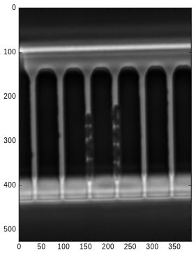

.. code:: python

    # the central starting point of the molyso highlevel interface
    # is the Image class
    
    from molyso.mm.image import Image
    image = Image()
    image.setup_image(test_image())
    
    # as a first test, let's run the autorotate routine, which will
    # automatically correct the rotation detected
    
    image.autorotate()
    print("Detected angle: %.4f°" % (image.angle,))
    pylab.imshow(image.image)

.. parsed-literal::

    Detected angle: -1.5074°

.. parsed-literal::

    <matplotlib.image.AxesImage at 0x7f09c8443e48>

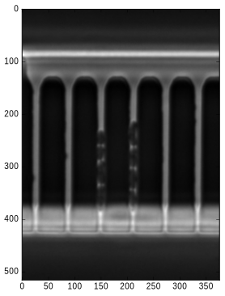

.. code:: python

    # the next two functions call the low-level steps
    # therefore, while not much is to see here, ...
    # the magic happens behind the curtains
    
    image.find_channels()
    image.find_cells_in_channels()
    
    from molyso.debugging.debugplot import inject_poly_drawing_helper
    inject_poly_drawing_helper(pylab)
    
    # embedded debugging functionality can be used
    # to produce an image with cells and channels drawn as overlay
    image.debug_print_cells(pylab)

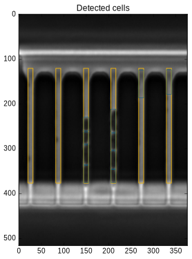

.. code:: python

    # let's look into an important part of the Image-class
    
    # the channels member, which supports the iterator interface
    # ... therefore, we call it as parameter to list()
    # to get a list of channels
    
    channels = list(image.channels)
    
    # and print some info about it (the .cells member works analogously)
    print("The first channel contains: %d cells." % (len(channels[0].cells),))
    print("The third channel contains: %d cells." % (len(channels[2].cells),))

.. parsed-literal::

    The first channel contains: 0 cells.
    The third channel contains: 4 cells.

.. code:: python

    # connectivity to original image data remains,
    # as long as it is not removed (due to memory/disk-space consumption reasons)
    
    channel = channels[2]
    pylab.imshow(channel.channel_image)

.. parsed-literal::

    <matplotlib.image.AxesImage at 0x7f09c8369898>

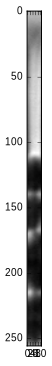

.. code:: python

    # lets look into the channel's cells ...
    
    print(list(channel.cells))

.. parsed-literal::

    [<molyso.mm.cell_detection.Cell object at 0x7f09d9e46f48>, <molyso.mm.cell_detection.Cell object at 0x7f09d9dd6248>, <molyso.mm.cell_detection.Cell object at 0x7f09d9e35d88>, <molyso.mm.cell_detection.Cell object at 0x7f09d9e151c8>]

.. code:: python

    # the last call did not really advance our insights ...
    # let's take a look at some properties of the cell:
    # *local_*top and *local_*bottom ...
    # which coincide witht the pixel positions within the channel image
    # Note: there is a top and bottom member as well,
    # but these values include the total offset of the channel within the image!
    
    for n, cell in enumerate(channel.cells):
        print("Cell #%d from %d to %d" % (n, cell.local_top, cell.local_bottom,))

.. parsed-literal::

    Cell #0 from 109 to 140
    Cell #1 from 142 to 169
    Cell #2 from 171 to 215
    Cell #3 from 217 to 255

.. code:: python

    # again, connectivity to the image data remains ...
    # lets show all individual cell images of that channel
    
    # long line just to prettify the output ...
    from functools import partial
    next_subplot = partial(pylab.subplot, int(numpy.sqrt(len(channel.cells)))+1, int(numpy.sqrt(len(channel.cells))))
    
    for n, cell in enumerate(channel.cells):
        next_subplot(n+1)
        pylab.title('Cell #%d' % (n,))
        pylab.imshow(cell.cell_image)
        
    pylab.tight_layout()

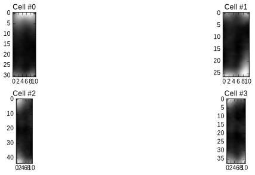

This was only a brief overview of some basic functionality. It might get
expanded in the future. For now, if you'd like to get deeper insights on
the working of *molyso*, I'd like to ask you to study the source files.

.. code:: python

    # PS: You can as well turn on Debug printing within IPython to get more insight on the internals
    from molyso.debugging import DebugPlot
    DebugPlot.force_active = True
    DebugPlot.post_figure = 'show'
    
    image.find_channels()
    image.find_cells_in_channels()

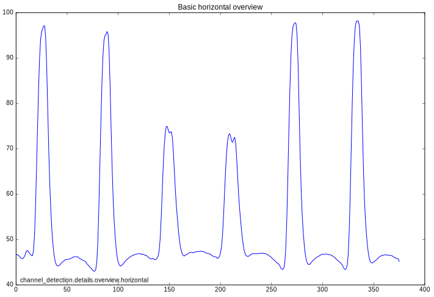

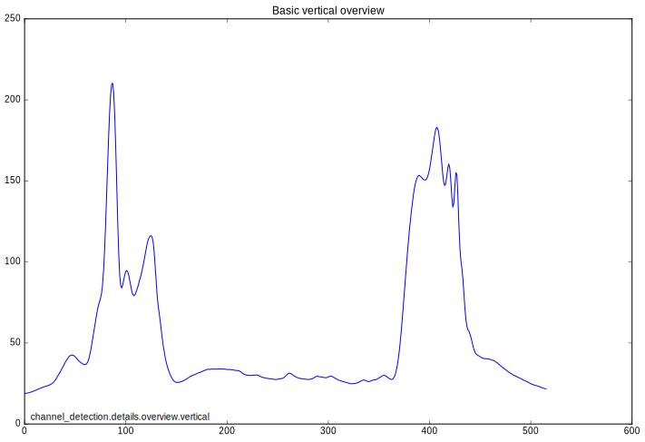

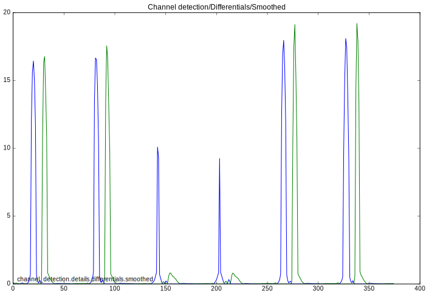

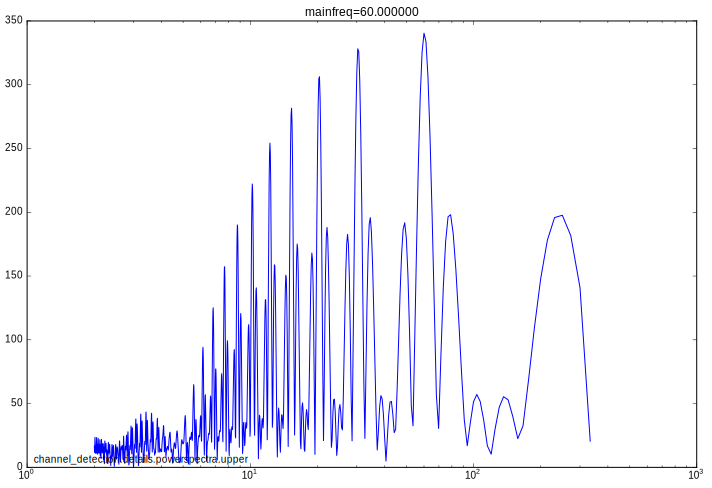

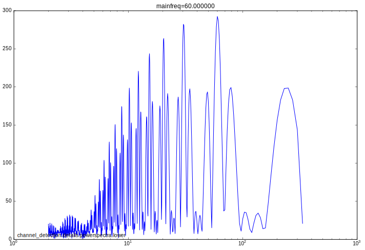

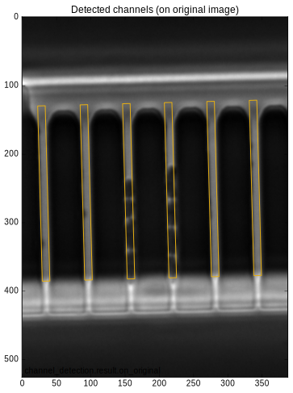

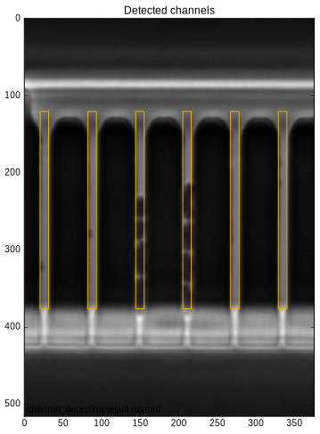

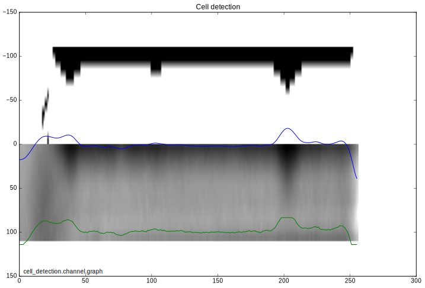

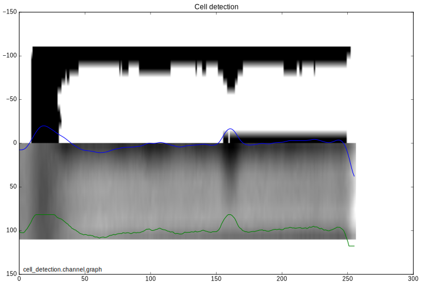

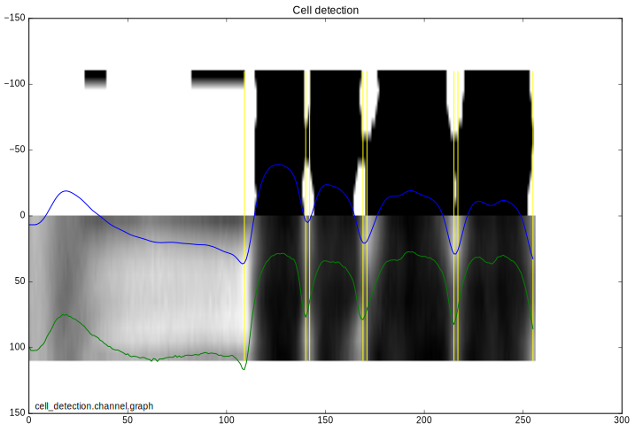

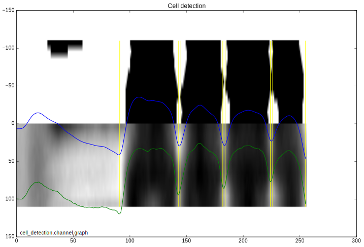

.. image:: _static/Example_molyso_Embedding_files/Example_molyso_Embedding_11_11.svg

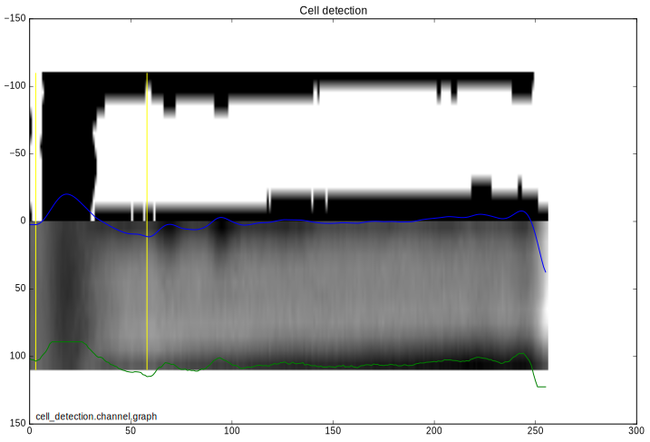

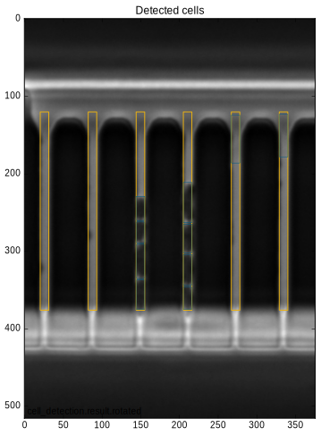

